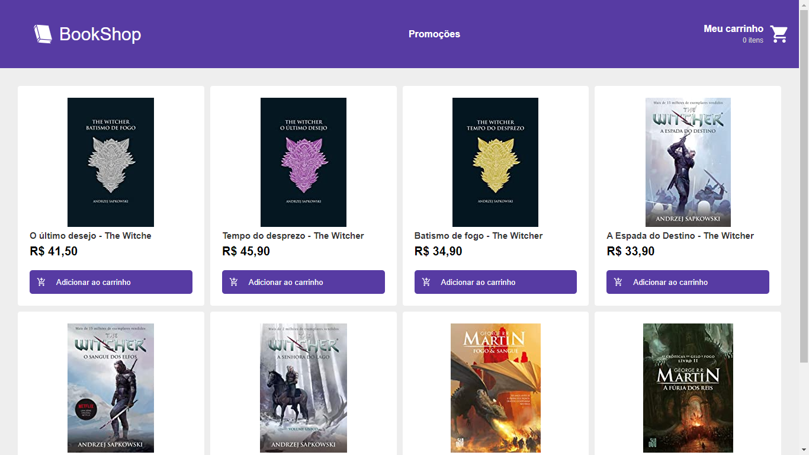

<h1 align="center">
    BookShop
</h1>

<h4 align="center">
  BookShop | with React and Redux.
</h4>

<div align="center">
 
</div>


<h2> Technologies </h2>

-  [ReactJS](https://reactjs.org/)
-  [Redux](https://redux.js.org/)
-  [React Router](https://github.com/ReactTraining/react-router)
-  [Axios](https://github.com/axios/axios)
-  [Immer](https://github.com/immerjs/immer)
-  [Polished](https://polished.js.org/)
-  [styled-components](https://www.styled-components.com/)
-  [React-Icons](https://react-icons.netlify.com/)
-  [json-server](https://github.com/typicode/json-server)

## :information_source: How To Use

To clone and run this application, you'll need [Git](https://git-scm.com), [Node.js v10.16][nodejs] or higher + [Yarn v1.13][yarn] or higher installed on your computer. From your command line:

```bash
# Clone this repository
$ git clone https://github.com/AffonsoMonteiro/book_shop

# Go into the repository
$ cd react-rocketshoes

# Install dependencies
$ yarn install

# Run the app
$ yarn start

# Run json-server
$ json-server --watch db.json
```


